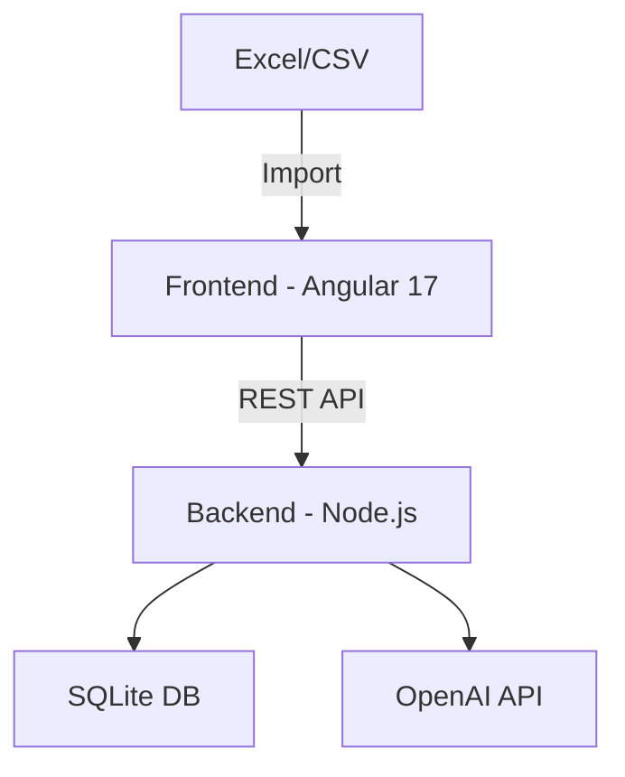

# 💰 Financial Tracker

<div align="center">

[](https://github.com/agosalvez/financial-tracker/blob/main/LICENSE)
[](https://nodejs.org)
[](https://angular.io)
[](https://www.docker.com/)

[Report Bug](https://github.com/agosalvez/financial-tracker/issues) · [Request Feature](https://github.com/agosalvez/financial-tracker/issues)

*Take control of your finances with AI-powered insights and automated categorization*

</div>

## ✨ Highlights

- 🤖 **AI-Powered Categorization**: Automatically categorize your transactions using advanced AI algorithms
- 📊 **Smart Analytics**: Visual insights into your spending patterns
- 📱 **Responsive Design**: Perfect experience on any device
- 🔒 **Privacy First**: Your financial data stays local
- 🚀 **Easy Import**: Support for various bank statement formats
- 💡 **Intelligent Insights**: Personalized financial recommendations

## 🎯 Key Features

### For Users
- **Quick Import**: Drag & drop your bank statements (Excel, CSV)
- **Smart Categories**: AI-powered automatic transaction categorization
- **Rich Dashboard**: Interactive charts and financial insights
- **Custom Rules**: Create your own categorization rules
- **Search & Filter**: Find any transaction instantly
- **Export & Backup**: Keep your data safe and portable

### For Developers
- **Modern Stack**: Angular 17 + Node.js 22
- **Docker Ready**: One command to run everything
- **API First**: Well-documented REST API
- **Extensible**: Easy to add new features
- **Testing**: Comprehensive test suite
- **CI/CD**: GitHub Actions workflows included

## 🚀 Quick Start

### Using Docker (Recommended)
```bash
# Clone the repo
git clone https://github.com/agosalvez/financial-tracker.git

# Start the application
docker-compose up -d

# Open http://localhost:4200 🎉
```

### Manual Setup
```bash
# Frontend
cd frontend
npm install
npm start

# Backend (new terminal)
cd backend
npm install
npm run dev
```

## 🏗️ Architecture



## 📊 Smart Dashboard

- **Financial Overview**: Quick view of your financial health
- **Spending Patterns**: AI-analyzed spending trends
- **Budget Tracking**: Real-time budget monitoring
- **Category Analysis**: Deep dive into spending categories
- **Predictive Insights**: AI-powered spending predictions

## 🛡️ Security Features

- **Local Processing**: Your data stays on your machine
- **No External Storage**: Bank statements processed locally
- **Encrypted Storage**: Secure data storage
- **Input Validation**: Robust security checks
- **Docker Security**: Non-root container execution

## 🎯 Roadmap

- [ ] Multi-currency support
- [ ] Mobile app (React Native)
- [ ] Bank API integrations
- [ ] Investment tracking
- [ ] Budget recommendations
- [ ] Savings goals
- [ ] PDF statement support

## 🤝 Contributing

We love your input! Check out our [Contributing Guide](CONTRIBUTING.md) to get started.

1. Fork the Project
2. Create your Feature Branch (`git checkout -b feature/AmazingFeature`)
3. Commit your Changes (`git commit -m 'Add some AmazingFeature'`)
4. Push to the Branch (`git push origin feature/AmazingFeature`)
5. Open a Pull Request

## 📜 License

Distributed under the MIT License. See `LICENSE` for more information.

## 🙏 Acknowledgments

- [OpenAI](https://openai.com) for AI categorization
- [Angular Team](https://angular.io) for the amazing framework
- [Node.js](https://nodejs.org) for the robust runtime
- All our [contributors](https://github.com/agosalvez/financial-tracker/graphs/contributors)

---

<div align="center">

**[Website](https://financial-tracker.com)** · **[Documentation](https://docs.financial-tracker.com)** · **[Twitter](https://twitter.com/financialtracker)**

Made with ❤️ by [Adrián Gosálvez](https://github.com/agosalvez)

</div>