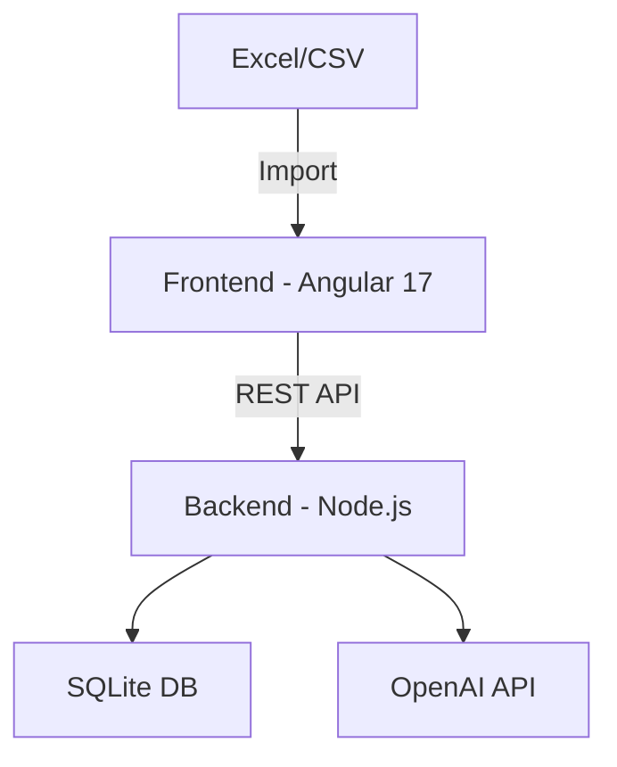

# 💰 Financial Tracker

<div align="center">

[](https://github.com/agosalvez/financial-tracker/blob/main/LICENSE)
[](https://nodejs.org)
[](https://angular.io)
[](https://www.docker.com/)

[Report Bug](https://github.com/agosalvez/financial-tracker/issues) · [Request Feature](https://github.com/agosalvez/financial-tracker/issues)

*Take control of your finances with AI-powered insights and automated categorization*

</div>

## ✨ Highlights

- 🤖 **AI-Powered Categorization**: Automatically categorize your transactions using advanced AI algorithms
- 🏦 **Multi-Bank Support**: Extensible parser system supporting multiple banks (Eurocaja Rural, ING Direct, and more)
- 🔍 **Auto Bank Detection**: Automatically detects bank type from uploaded files
- 📊 **Smart Analytics**: Visual insights into your spending patterns with account separation
- 📱 **Responsive Design**: Perfect experience on any device
- 🔒 **Privacy First**: Your financial data stays local
- 🚀 **Easy Import**: Support for various bank statement formats (CSV, Excel)
- 💡 **Intelligent Insights**: Personalized financial recommendations
- ⚡ **Optimized Processing**: Smart categorization that only uses AI for new concepts

## 🎯 Key Features

### For Users
- **Quick Import**: Drag & drop your bank statements (Excel, CSV) with automatic bank detection
- **Multi-Account Management**: Separate transactions by bank account with easy account switching
- **Smart Categories**: AI-powered automatic transaction categorization (only for new concepts)
- **Rich Dashboard**: Interactive charts and financial insights filtered by account
- **Annual Summary**: Comprehensive yearly financial overview with monthly evolution
- **Advanced Filters**: 
  - Filter by date range, category, concept
  - Quick year selection checkbox for instant full-year view
  - All filters in a single compact row
- **Transaction Management**: 
  - Edit mode toggle for safety (prevents accidental edits/deletions)
  - Edit and validate transaction categories
  - Delete transactions (when edit mode is enabled)
- **Custom Rules**: Create your own categorization rules
- **Search & Filter**: Find any transaction instantly
- **Export & Backup**: Keep your data safe and portable

### For Developers
- **Modern Stack**: Angular 17 + Node.js 22
- **Docker Ready**: One command to run everything
- **Extensible Parser System**: SOLID principles-based architecture for easy bank parser addition
- **Automatic Bank Detection**: Smart detection system using confidence scoring
- **API First**: Well-documented REST API
- **Optimized AI Usage**: Efficient categorization that caches results and only calls OpenAI for new concepts
- **Extensible**: Easy to add new features
- **Testing**: Comprehensive test suite
- **CI/CD**: GitHub Actions workflows included

## 🚀 Quick Start

### Using Docker (Recommended)
```bash
# Clone the repo
git clone https://github.com/agosalvez/financial-tracker.git

# Start the application
docker-compose up -d

# Open http://localhost:4200 🎉
```

### Manual Setup
```bash
# Frontend
cd frontend
npm install
npm start

# Backend (new terminal)
cd backend
npm install
npm run dev
```

## 🏗️ Architecture


```mermaid
graph TD
    A[Frontend - Angular 17] -->|REST API| B[Backend - Node.js]
    B --> C[SQLite DB]
    B --> D[OpenAI API]
    E[Excel/CSV] -->|Import| A
```

## 📊 Smart Dashboard

- **Financial Overview**: Quick view of your financial health per account
- **Account Separation**: View transactions and analytics separately for each bank account
- **Spending Patterns**: AI-analyzed spending trends by account
- **Annual Summary**: Monthly evolution, category breakdown, and comparative analysis
- **Budget Tracking**: Real-time budget monitoring
- **Category Analysis**: Deep dive into spending categories
- **Transaction Management**: 
  - Edit mode toggle for safety (prevents accidental changes)
  - Full CRUD operations for transactions
  - Visual icons for edit (✏️) and delete (🗑️) actions
- **Predictive Insights**: AI-powered spending predictions

## 🔒 Safety Features

- **Edit Mode Toggle**: Transaction editing and deletion require explicit activation of edit mode
- **Visual Indicators**: Clear icons distinguish between edit and delete actions
- **Confirmation Modals**: Delete operations require user confirmation
- **Account Isolation**: All operations are filtered by selected bank account

## 🏦 Supported Banks

Currently supported banks (with more being added):

- **Eurocaja Rural**: CSV format support
- **ING Direct**: Excel (XLS, XLSX) and CSV format support

### Adding New Banks

The system uses an extensible parser architecture based on SOLID principles. To add a new bank:

1. Create a new parser class extending `BaseParser`
2. Implement the required methods (`parseFile`, `detect`)
3. Register it in `backend/src/parsers/index.js`

See `backend/src/parsers/README.md` for detailed instructions.

## 🛡️ Security Features

- **Local Processing**: Your data stays on your machine
- **No External Storage**: Bank statements processed locally
- **Encrypted Storage**: Secure data storage
- **Input Validation**: Robust security checks
- **Docker Security**: Non-root container execution

## 🤖 AI Categorization

The app uses OpenAI to automatically categorize transactions:

- **Smart Detection**: Only categorizes new concepts (not seen before)
- **Caching**: Previously categorized concepts are reused, saving API calls
- **Cost Optimization**: Logs show exactly how many OpenAI API calls were made per upload
- **Confidence Scoring**: Each categorization includes a confidence level
- **Type Validation**: Ensures income/expense categories match transaction type
- **Batch Processing**: Groups unique concepts before categorization for efficiency

### API Usage

The system optimizes OpenAI API usage by:
- Checking database first for existing categorizations
- Only calling OpenAI for truly new concepts
- Batching similar concepts together
- Providing detailed logs of API calls made

## 🎯 Roadmap

- [ ] More bank parsers (BBVA, Santander, etc.)
- [ ] Multi-currency support
- [ ] Mobile app (React Native)
- [ ] Bank API integrations
- [ ] Investment tracking
- [ ] Budget recommendations
- [ ] Savings goals
- [ ] PDF statement support
- [ ] Transaction templates and rules

## 🤝 Contributing

We love your input! Check out our [Contributing Guide](CONTRIBUTING.md) to get started.

1. Fork the Project
2. Create your Feature Branch (`git checkout -b feature/AmazingFeature`)
3. Commit your Changes (`git commit -m 'Add some AmazingFeature'`)
4. Push to the Branch (`git push origin feature/AmazingFeature`)
5. Open a Pull Request

## 📜 License

Distributed under the MIT License. See `LICENSE` for more information.

## 🙏 Acknowledgments

- [OpenAI](https://openai.com) for AI categorization
- [Angular Team](https://angular.io) for the amazing framework
- [Node.js](https://nodejs.org) for the robust runtime
- All our [contributors](https://github.com/agosalvez/financial-tracker/graphs/contributors)

---

<div align="center">

**[Website](https://financial-tracker.com)** · **[Documentation](https://docs.financial-tracker.com)** · **[Twitter](https://twitter.com/financialtracker)**

Made with ❤️ by [Adrián Gosálvez](https://github.com/agosalvez)

</div>